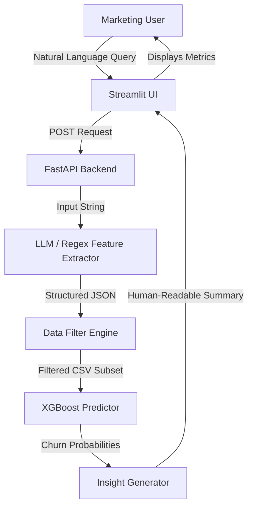

# 📊 Churn Prediction with LLM-Powered Chat Interface

## 📋 Project Overview
This project is a Proof of Concept (PoC) designed for a telecom marketing team. It combines a high-performance **XGBoost classification model** with a **Natural Language Interface** powered by an open-source LLM (**Qwen2.5-1.5B**). This allows non-technical staff to query complex customer data and receive instant churn risk insights using everyday English.

---

## 🎯 Business & Technical Motivations

### 1. Data Privacy (Open-Source LLM)
As per the client's strict security requirements, this solution avoids third-party/closed-source APIs (like OpenAI). By using **Qwen2.5-1.5B-Instruct** running locally via Hugging Face Transformers, all sensitive customer data remains within the company's private infrastructure.

### 2. Profit-Driven Model Tuning
In telecom, the cost of losing a customer (Churn) is much higher than the cost of a marketing promotion. Therefore, the model is tuned to a **0.28 probability threshold**, prioritizing **Recall (~80%)** to ensure we capture as many potential churners as possible.

### 3. Handling Data Imbalance
The raw dataset was highly imbalanced (more loyal customers than churners). We implemented **SMOTE (Synthetic Minority Over-sampling Technique)** during the training phase to balance the classes, ensuring the model is highly sensitive to churn patterns.

---

## 🏗️ System Architecture & Data Flow


The following diagram illustrates how natural language is transformed into a machine-learning prediction:



---

## 🧰 Technologies Used
* **Python 3.12**
* **FastAPI & Uvicorn** – Backend API & Server.
* **Streamlit** – Frontend User Interface.
* **XGBoost** – Core Prediction Model.
* **Transformers (Hugging Face)** – Local LLM Integration.
* **imbalanced-learn (SMOTE)** – Data balancing.
* **joblib** – Model & Preprocessor serialization.

---

## ⚙️ Installation & Setup

### 1. Prerequisites
* Python 3.12
* Virtual Environment (recommended)

### 2. Install Dependencies
```bash
pip install -r requirements.txt
```

### 3. Running the Application
**Step 1: Start the FastAPI Server**
```bash
uvicorn api:app --reload
```
*API docs available at:* `http://127.0.0.1:8000/docs`

**Step 2: Start the Streamlit Dashboard**
```bash
streamlit run app_streamlit.py
```
*UI available at:* `http://localhost:8501`

---

## 🖥️ Usage & Sample Queries

The interface accepts natural language questions and returns the count of matching customers along with the number of those at risk of leaving.

**Try these examples:**
* *"Senior citizens with fiber optic and monthly charges > 70"*
* *"Female customers who are married and have no internet service"*
* *"Tell me about male customers with tenure less than 12 months"*

---

## 🧪 Model Performance Summary
* **Algorithm:** XGBoost Classifier
* **Validation Strategy:** 5-Fold Cross-Validation (GridSearchCV)
* **Optimization:** Precision-Recall Curve Optimization
* **Final Metrics:**
    * **Churn Recall:** ~80% (High sensitivity to potential leavers)
    * **Overall Accuracy:** ~81%
    * **Churn Precision:** ~67%

---

## 🔮 Future Roadmap
* **Multilingual Support:** Adding Arabic language parsing for local markets.
* **Quantization:** Moving to 4-bit quantization for faster LLM inference on CPU.
* **Dockerization:** Containerizing the API and UI for scalable cloud deployment.

---

## 👥 Deliverables Checklist
- [x] Churn Classification Model (XGBoost)
- [x] API & Chatbot Pipeline (FastAPI + Transformers)
- [x] Architecture Diagram (Mermaid)
- [x] Technical & Business Documentation
