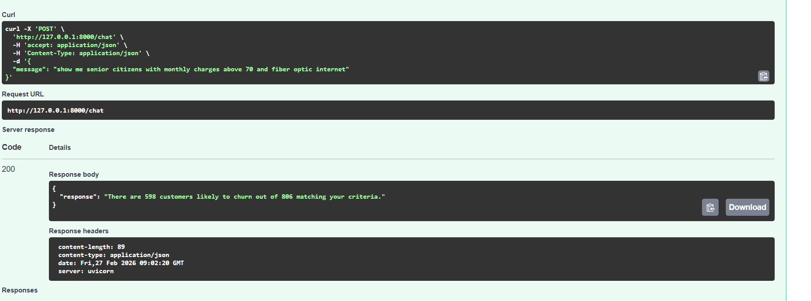
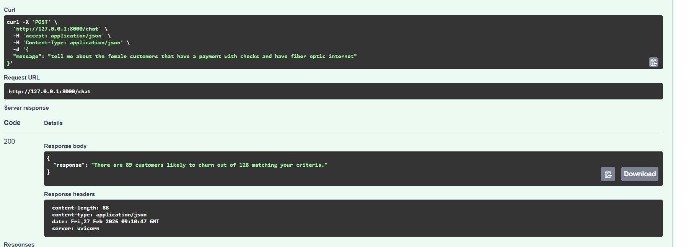
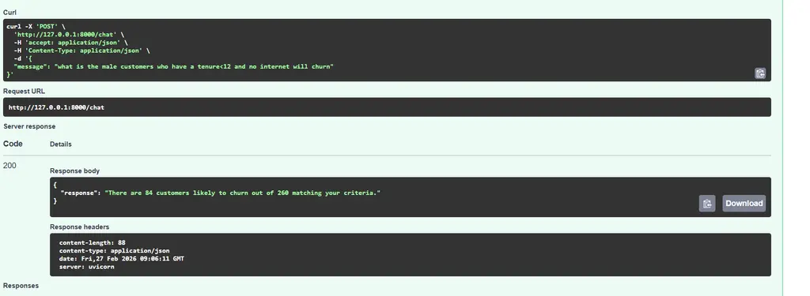
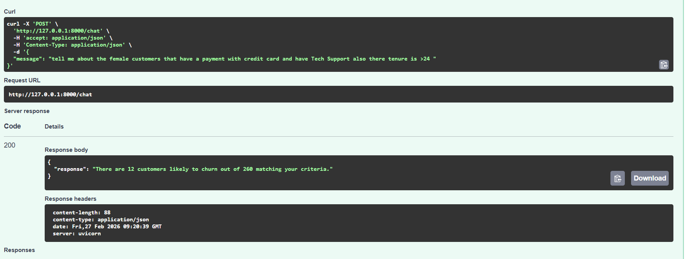
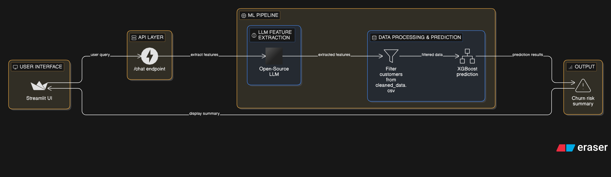
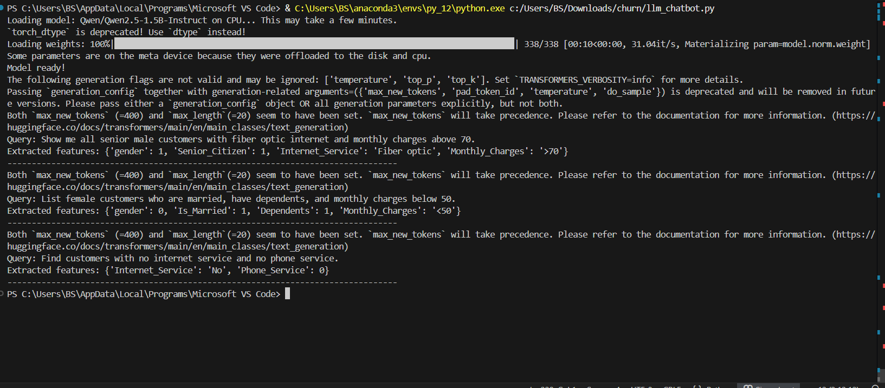

# 📸 Project Screenshots & Visual Gallery

This directory contains visual documentation of the **AI-Powered Churn Assistant**. These screenshots demonstrate the system's compliance with the project requirements, including the UI design, API structure, and model analysis.

---

## 🖥️ Application Interface

### **1. UI Overview**
The primary Streamlit dashboard designed for the marketing team. It features a clean chat interface, project overview sidebar, and sample query suggestions.

### **2. Query Example**
A demonstration of the natural language processing pipeline. The assistant parses a user query, filters the dataset, and displays the churn risk metrics and specific customer examples.

---

## ⚙️ Backend & API 

### **3. API Swagger**
The interactive FastAPI documentation (`/docs`). This view confirms the existence of the `/chat` endpoint and the Pydantic schemas used for structured communication between the LLM and the backend.

---

## 🧠 Logic & Architecture

### **4. Architecture Diagram**
A high-level overview of the data flow: from the user's natural language input, through the Qwen2.5-1.5B parser, into the XGBoost classifier, and back to the UI.

### **5. LLM Test**
how the llm exract features in the write way

---

## 📂 Summary of Files
| File Name | Description |
| :--- | :--- |
| `ui_main.png` | Main Streamlit interface and sidebar. |
| `query_example.png` | Results of a live natural language query. |
| `api_swagger.png` | FastAPI Swagger UI documentation. |
| `architecture_diagram.png` | Visual flow of data between components. |
| `model_analysis.png` | Training metrics and EDA from the notebook. |
